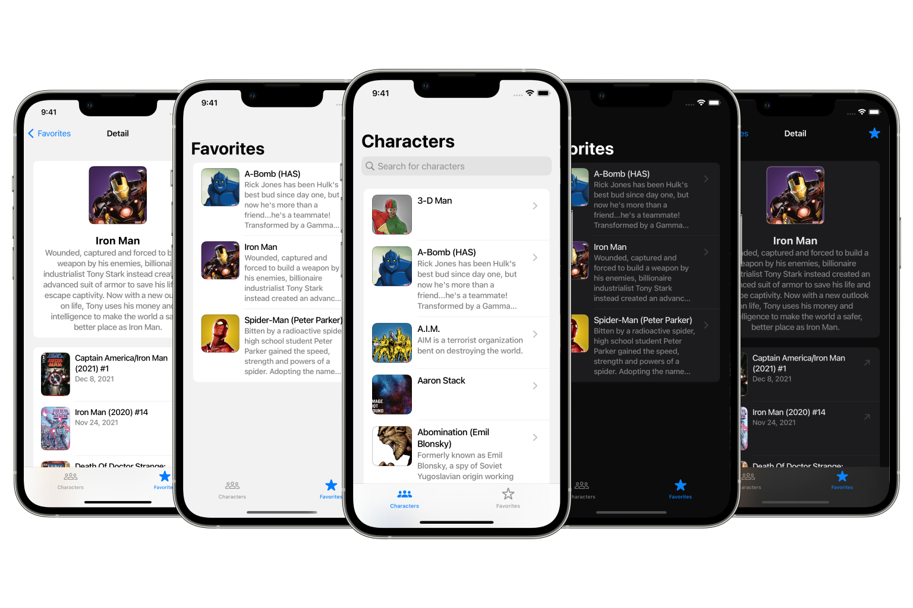

# PATH Assignment App

> This project was made within "PATH iOS Assignment".

⚠️ To access the API, get an API public and private key **[here](https://developer.marvel.com)** and replace it with "API_PUBLIC_KEY" and "API_PRIVATE_KEY" in the project.

## Architecture

MVVM-C architecture was used in this project.

## Compatibility

Requires iOS 11.0 or later. Compatible with iPhone.

## API

- **[Marvel API](https://developer.marvel.com)**

## Third Party Libraries

> Added via Swift Package Manager.

- **[Alamofire](https://github.com/Alamofire/Alamofire)**
- **[Nuke](https://github.com/kean/Nuke)**
- **[LBTATools](https://github.com/bhlvoong/LBTATools)**
